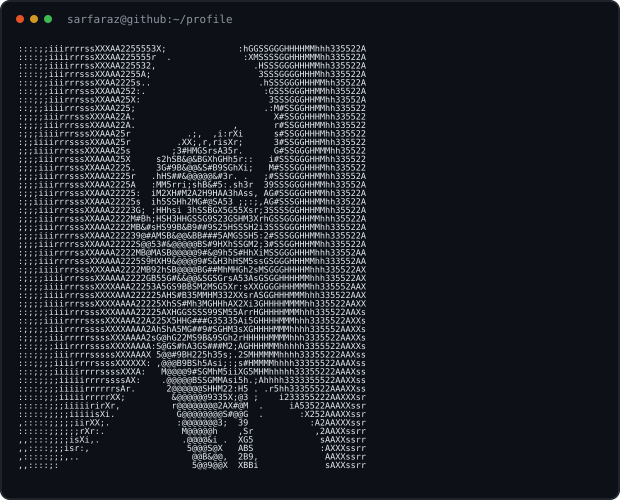

<!-- GitHub Profile README for sarfarazahmedp -->

<div align="center">

```text
 ███████╗ █████╗ ██████╗ ███████╗ █████╗ ██████╗  █████╗ ███████╗
 ██╔════╝██╔══██╗██╔══██╗██╔════╝██╔══██╗██╔══██╗██╔══██╗╚══███╔╝
 ███████╗███████║██████╔╝█████╗  ███████║██████╔╝███████║  ███╔╝
 ╚════██║██╔══██║██╔══██╗██╔══╝  ██╔══██║██╔══██╗██╔══██║ ███╔╝
 ███████║██║  ██║██║  ██║██║     ██║  ██║██║  ██║██║  ██║███████╗
 ╚══════╝╚═╝  ╚═╝╚═╝  ╚═╝╚═╝     ╚═╝  ╚═╝╚═╝  ╚═╝╚═╝  ╚═╝╚══════╝
```

<b>Python Developer · Backend Builder · Data & AI Learner</b>

[](https://sarfarazahmedp.github.io/my-projects1/)
[](https://www.linkedin.com/in/sarfaraz-ahmed-pahore-3150b12b0)
[](mailto:sarfarazahmedpahore3@email.com)

</div>

---

<table>
  <tr>
    <td width="52%" valign="top">



    </td>
    <td width="48%" valign="top">

### `profile.json`

```json
{
  "name": "Sarfaraz Ahmed",
  "location": "Pakistan",
  "role": "Python Developer",
  "available_for": "learning & collaboration",
  "motto": "Build. Learn. Repeat."
}
```

    </td>
  </tr>
</table>

## `> tech_stack --list`

<p align="center">
  
</p>

<p align="center">
  
  
</p>

## `> ls ./featured-projects`

| Project | Description | Stack |
| :-- | :-- | :-- |
| [**Portfolio Website**](https://sarfarazahmedp.github.io/my-projects1/) | Personal portfolio and project showcase. | HTML, CSS, JavaScript |
| **Web Scraper + Data Dashboard** | Scrapes public data, cleans it, and visualizes insights. | Python, BeautifulSoup, Pandas, Streamlit |
| **AI Study Assistant** | An API-powered assistant for study questions and explanations. | FastAPI, Gemini API, LLMs |
| **Expense Tracker** | Tracks expenses and produces category reports using SQLite. | Python, SQLite, SQL |
| [**Student Record System**](https://sarfarazahmedp.github.io/my-projects/student_record.html) | Persistent student-record CRUD project. | C, File I/O |
| [**Bank Account OOP**](https://sarfarazahmedp.github.io/my-projects/bank_system.html) | Banking simulation using object-oriented programming. | Java, OOP |

## `> contribution activity`

<div align="center">


<br><br>

<picture>
  <source media="(prefers-color-scheme: dark)" srcset="https://raw.githubusercontent.com/sarfarazahmedp/sarfarazahmedp/output/github-contribution-grid-snake-dark.svg">
  <source media="(prefers-color-scheme: light)" srcset="https://raw.githubusercontent.com/sarfarazahmedp/sarfarazahmedp/output/github-contribution-grid-snake.svg">
  
</picture>

</div>

## `> contact --open`

```text
I am open to learning opportunities, useful collaborations,
and beginner-friendly projects. Let's build something worthwhile.
```

- 🌐 Portfolio: [sarfarazahmedp.github.io/my-projects1](https://sarfarazahmedp.github.io/my-projects1/)
- 💼 LinkedIn: [Sarfaraz Ahmed Pahore](https://www.linkedin.com/in/sarfaraz-ahmed-pahore-3150b12b0)
- ✉️ Email: [sarfarazahmedpahore3@email.com](mailto:sarfarazahmedpahore3@email.com)

<div align="center"><sub>"Small projects. Consistent progress. Meaningful skills."</sub></div>
